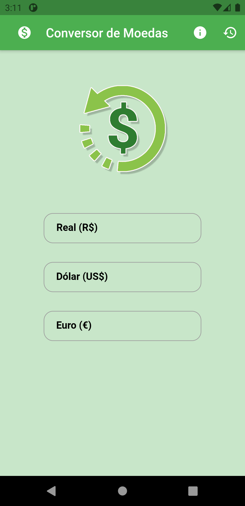

# Money Converter

# Sobre o Projeto
O Money Converter é um aplicativo simples onde é possível ver a cotação atual do dólar e do euro e também realizar a conversão para essas duas moedas. Foi o primeiro app que desenvolvi utilizando o framework da Google, o Flutter.

# Layout

    

# Funcionamento

O aplicativo consegue o valor de cotação do dólar e do euro através de uma API externa, ou seja, o valor está sempre atualizado. O seu funcionamento é bem simples, basta inserir um valor seja ele em real, dólar e euro que automaticamente os outros serão convertidos. É possível ver a cotação atual do dólar e do euro através de um botão na AppBar e também através de um botão limpar os campos. 

Foi um projeto desenvolvido com o uso de recursos bem legais, como por exemplo, async, consumir API com a biblioteca Http, Future, FutureBuilder, Maps entre outras funcionalidades interessantes.

# Objetivo
O objetivo deste aplicativo foi ter o primeiro contato dentro de uma aplicação completa em Flutter.

# Tecnologias Utilizadas
- Flutter
- Http

# Autor
Murilo Steinmetz Böhlke

https://www.linkedin.com/in/murilobohlke/
